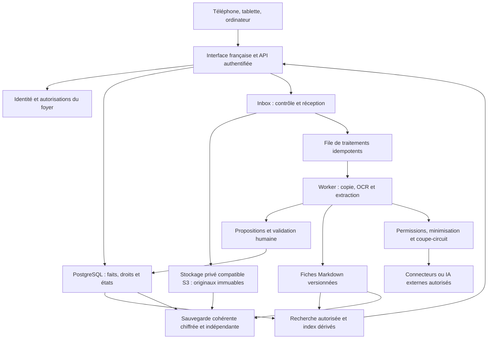

# Architecture initiale

Décision du 12 septembre 2026. Cette architecture distingue la démonstration locale du service familial cible. Les choix de stack et leurs alternatives sont consignés dans [ADR-0001](adr/0001-stack.md) ; les exigences citables figurent dans la [spécification](product-specification.md).

## Ce que la fondation exécute

Une application Next.js App Router, React et TypeScript présente une interface française adaptée au mobile et un jeu de données entièrement synthétique. La logique métier locale reste testable sans serveur distant. Les interactions de démonstration ne sont pas une preuve de conservation, de contrôle d'accès ou de synchronisation.

Les parcours de la démo comprennent quatre exemples initiaux, le chargement d'un cinquième exemple embarqué, une recherche lexicale et par catégorie, les détails avec source et empreinte de l'original texte, une proposition à vérifier puis accepter ou refuser, et les états de connecteurs fictifs. Les modifications demeurent en mémoire. Le coupe-circuit de démonstration est activé au démarrage. Le point `/api/health` indique explicitement `mode: demo`, `syntheticDataOnly: true` et `persistence: false` ; il ne mesure pas la disponibilité d'un coffre.

Le processus Node.js peut être exécuté localement. Docker Compose prépare une voie locale portable pour l'application et un profil PostgreSQL synthétique optionnel ; leur vérification effective est indiquée dans les preuves du lot. L'application ne se connecte à aucune base PostgreSQL ni à aucun stockage S3. Elle n'effectue ni OCR ni appel à une IA externe. Aucune infrastructure Dev ou Production distante n'est créée.

## Périmètre public et projet privé distinct

Le dépôt public cible contient le produit Hestia installable, son harnais de développement, ses tests, ses données synthétiques et sa documentation utilisateur et contributeur autorisée. L'automatisation privée d'animation, de communication, d'analyse d'activité ou de publication LinkedIn relève d'un autre projet non public. Aucun code, configuration, secret, procédure interne, service ou module de cette usine privée n'est intégré à Hestia. Cette séparation applique PUB-01 à PUB-06 de la [spécification](product-specification.md).

Le seul flux Hestia permis vers ce projet distinct est la lecture d'informations déjà publiques et utiles : changements validés, versions, documentation, issues, retours et statistiques publiques. Il ne reçoit aucun accès aux documents, profils familiaux, secrets ou à la Production privée d'une instance. Aucun compte de service, jeton, connexion SQL/S3 ou canal d'accès au coffre n'est à prévoir pour lui. Les connecteurs familiaux du schéma ci-dessous ne constituent pas une passerelle vers l'usine d'animation.

Les notes de version, démonstrations, articles, réponses communautaires, publications LinkedIn et analyses d'adoption que ce projet privé pourrait préparer doivent s'appuyer sur des preuves publiques vérifiées. Leur diffusion au nom du responsable du projet requiert un brouillon, un aperçu et son accord explicite au moins dans la phase initiale. Un éventuel accès LinkedIn relève d'une autorisation officielle limitée et révocable, sans transmission ou stockage du mot de passe. Ces contraintes de frontière ne créent aucune procédure interne ni intégration de communication dans Hestia, et le premier lot ne fonde pas cet autre projet.

## Architecture cible

Le schéma décrit une cible ; les blocs d'identité, persistance, traitements, sauvegarde et réseau externe ne sont pas livrés par la démonstration.

## Frontières et responsabilités

| Composant cible | Responsabilité et limite |
| --- | --- |
| Interface web | Dépôt simple, recherche, lecture avec provenance, validation légère, profil et état des connecteurs. Aucun secret serveur transmis au navigateur. |
| API et services métier | Valider les entrées, vérifier les droits sur chaque opération et fournir des réponses limitées au périmètre autorisé. Le masquage dans l'interface ne constitue pas une autorisation. |
| PostgreSQL | Source de vérité des faits validés, droits, propositions, relations, exécutions et versions. Transactions pour valider un fait avec son historique et sa preuve. |
| Stockage d'objets compatible S3 | Conserver les octets originaux sous des clés opaques, empêcher les écrasements dans le chemin d'ingestion et servir des accès privés contrôlés. L'API S3 n'assure pas seule l'immuabilité : politiques, versionnement et tests doivent la démontrer. |
| Worker | Effectuer hors requête interactive les contrôles de fichier, OCR et extractions ; gérer reprise, délais, ressources et doublons sans créer d'effets répétés. |
| Markdown | Conserver des fiches lisibles et exportables, avec métadonnées et liens stables. Toute correction passe par une commande métier traçable ; un texte généré ne remplace pas silencieusement un fait validé. |
| Recherche | Combiner recherche lexicale et, ultérieurement, index sémantique. Filtrer les documents autorisés avant restitution et avant constitution du contexte d'un modèle. |
| Adaptateurs | Isoler les différences d'hébergement, stockage, identité, OCR et IA. Les services métier dépendent de contrats, pas d'un SDK propriétaire. |
| Export/restauration | Exporter un ensemble cohérent et versionné, vérifier son intégrité et reconstruire les relations et les droits chez un autre hébergeur. |

## Modèle de données conceptuel

Les entités suivantes guident les futurs schémas ; aucune migration SQL n'est livrée dans ce lot.

| Entité | Données minimales et invariants |
| --- | --- |
| Household / Member / AccessGrant | Instance et membres autorisés, droits explicites, périmètre et expiration du partage. Ne pas déduire un droit du nom d'un dossier. |
| Document / OriginalObject | Identifiants stables, clé et version d'objet, empreinte SHA-256, type, taille, provenance, date d'ajout, classification et droits. Le nom du fichier est une métadonnée non fiable. |
| Extraction / ProposedFact | Outil et version, tentative, valeur proposée, niveau d'incertitude, extrait/page source et état à valider/confirmé/corrigé/rejeté. |
| ValidatedFact / FamilyProfile | Valeur typée, unité/devise ou fuseau si pertinent, origine, validateur, date, niveau d'accès et historique. Une saisie manuelle est identifiée comme telle. |
| DocumentNote / SourceReference | Fiche Markdown et sa version, références vers originaux et faits ; les index qui en découlent sont reconstructibles. |
| ReminderProposal | Échéance détectée et preuve, état de validation, destination proposée. Une détection n'autorise pas un envoi. |
| Connector / ConnectorRun | Permissions accordées, actif/désactivé, dernière tentative/réussite, erreur expurgée, identifiant d'idempotence et éventuel arrêt global. |
| AuditEvent / ExportManifest | Action, acteur, objet, date et résultat sans contenu sensible inutile ; manifeste d'export versionné et empreintes. |

Les identifiants ne portent pas de noms de personnes. Les montants ne sont pas des nombres flottants approximatifs ; dates civiles et instants sont distincts. Les durées de conservation des journaux et dérivés devront être définies avant une utilisation réelle.

## Ingestion et cohérence

1. Authentifier l'auteur et vérifier son droit de dépôt ; valider taille, format réel et quota avant traitement.
2. Calculer l'empreinte et détecter les doublons dans le périmètre autorisé, sans dévoiler l'existence d'un document privé à un autre membre.
3. Écrire l'original sans écrasement puis vérifier les octets et enregistrer une référence stable. Une clé d'idempotence couvre les reprises.
4. Traiter une copie isolée. Considérer tout contenu du document comme non fiable, y compris des instructions visant l'IA.
5. Produire des propositions avec preuve. Les faits incertains et les échéances attendent une validation adaptée.
6. Publier les fiches et index dérivés après validation selon les règles du domaine ; garder la provenance et le droit d'accès jusqu'à la réponse finale.

La base SQL et le stockage d'objets ne partagent pas de transaction atomique. Un état d'ingestion explicite, une file transactionnelle ou un mécanisme équivalent de reprise, puis une réconciliation des objets orphelins sont nécessaires. Une erreur ne doit pas produire de document annoncé comme archivé mais dépourvu d'original. Aucun de ces mécanismes n'est simulé comme une garantie acquise dans la démo.

## IA et connecteurs

La recherche lexicale constitue un service autonome. OCR local, modèles locaux et IA externe seront évalués sur des fixtures synthétiques avant choix. Les abonnements de développement ne sont pas considérés comme un droit d'intégrer leurs interfaces dans le produit.

Chaque échange externe passe par un contrôle central : connecteur activé, permission limitée, coupe-circuit désactivé, destination autorisée, données minimisées et accord nécessaire enregistré. Un worker revérifie ces conditions avant chaque tentative réseau. La réactivation du coupe-circuit ne réactive pas implicitement tous les connecteurs. Un identifiant d'exécution relie permission, résultat et erreur sans journaliser le document complet.

## Hébergement et promotion

Le service cible doit fonctionner quand l'ordinateur familial est éteint. Un serveur ou une offre hébergée sera donc choisi après comparaison de coût, confidentialité, exploitation et restauration. Vercel peut héberger l'application, tandis que les traitements longs, PostgreSQL et les originaux requièrent des composants adaptés ; aucun système de fichiers éphémère d'une fonction ne devient le stockage principal.

Docker Compose constitue l'autre voie de référence : application, worker et services persistants isolés, avec TLS et exploitation documentés avant exposition. Next.js documente son exécution sur un serveur Node.js et les précautions d'auto-hébergement. [Documentation Next.js](https://nextjs.org/docs/app/guides/self-hosting).

Dev et Production utilisent des bases, objets, identités techniques, clés et autorisations distincts. Les previews utilisent des données synthétiques et, si nécessaire, des ressources jetables. Promouvoir l'artefact testé exige de séparer configuration d'exécution et build ; aucune valeur privée de Production n'est incorporée au navigateur ni requise lors du build. Si un hébergeur impose une reconstruction, son équivalence ne peut être présumée : une procédure et des preuves spécifiques seront nécessaires avant autorisation de cette voie de livraison.

## Vérifications à apporter lors des prochains lots

La cible sera qualifiée progressivement par des tests d'autorisation côté serveur, d'immutabilité et reprise d'ingestion, d'isolation SQL/S3, de validation avec source, de coupure réseau, d'export/restauration et par la recette mobile. Ces familles de preuve décrivent des obligations d'architecture, sans créer de tâches ou de statuts parallèles au backlog GitHub.
